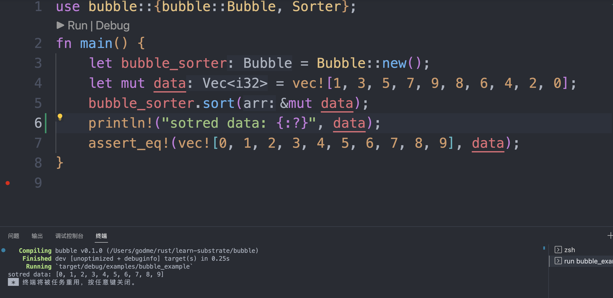

# Sorter

本项目定义了[Sorter](src/lib.rs#Sorter) `trait`，对于实现了[Ord](https://doc.rust-lang.org/std/cmp/trait.Ord.html)+[Eq](https://doc.rust-lang.org/std/cmp/trait.Eq.html)的对象都可以完成排序工作。

# bubble

[bubble](src/bubble.rs#Bubble)实现了[Sorter](src/lib.rs#Sorter) `trait`，使用冒泡进行排序。

# example and test

可以在[example](examples/bubble_example.rs) 或者 [test](src/bubble.rs#tests) 中查看对应用法。

# doc
使用`cargo doc --open`可以查看文档。

